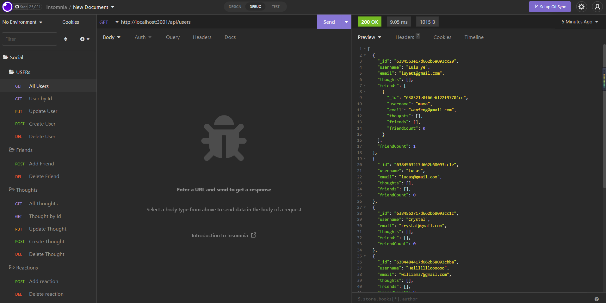

# Social NetWork API
    This API allows users share their thoughts, react to their friends' thoughts, and create a friend list.

## Mock Up
    Here's a screenshot.

## Video Link
    https://drive.google.com/file/d/1K5qLcqr806fw0WKojqlf1dbmdKyyUZUV/view

## Installation
    After you clone the repo into local, run the following commands to install the dependencies.
    npm i
    npm i moment

## Usage
    After completed your installation, run the following commands "npm start"

